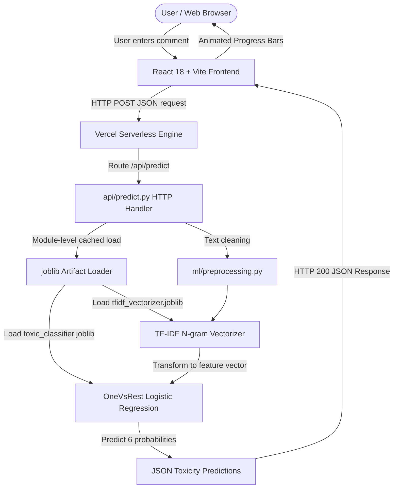

# System Architecture & Technical Design

This document details the end-to-end architecture, technical design decisions, data flow, and deployment mechanics of the **Toxic Comment Classification System**.

---

## 1. High-Level Architecture Overview

The system is designed to operate completely within a single Vercel deployment without requiring any external backend hosting (such as Render, Railway, AWS, or Azure) or database servers.



---

## 2. Component Specifications

### A. Frontend Layer (React 18 + Vite + Tailwind CSS)
- **Location**: `frontend/`
- **Framework**: React 18 initialized with Vite for rapid build times and lightweight bundles.
- **Styling**: Tailwind CSS with custom color tokens for toxicity classes.
- **State Management**: React state hooks (`useState`, `useEffect`) managing comment input, API responses, loading animations, and error handling.
- **API Client**: `frontend/src/services/api.js` utilizing relative `/api/predict` fetch calls, eliminating CORS issues and API key dependencies.

### B. Serverless API Endpoint (`api/predict.py`)
- **Location**: `api/predict.py`
- **Runtime**: Vercel Python 3.9+ Serverless Execution Environment.
- **Interface**: Implements standard Python `http.server.BaseHTTPRequestHandler` with `do_POST` and `do_OPTIONS` handlers.
- **Input Validation**:
  - Rejects empty strings and whitespace-only payloads.
  - Enforces a 5,000 character upper limit to protect serverless memory.
  - Catches malformed JSON without exposing stack traces.
- **Model Caching Strategy**:
  - Global variables `_MODEL_CACHE` and `_VECTORIZER_CACHE` store loaded `.joblib` instances in module scope.
  - Subsequent requests served by the same serverless instance reuse the cached model, avoiding reload latency (~1ms inference time).

### C. Machine Learning Engine (`ml/`)
- **Location**: `ml/train.py`, `ml/evaluate.py`, `ml/preprocessing.py`
- **Feature Extraction**: `TfidfVectorizer` (sublinear TF scaling, max features=15,000, unigrams & bigrams).
- **Classifier**: `OneVsRestClassifier` wrapping 6 binary `LogisticRegression` estimators with `class_weight='balanced'`.
- **Serialized Artifacts**: Saved using `joblib.dump(..., compress=3)` yielding tiny compressed files (< 5 MB) stored under `models/`.

---

## 3. Request-Response Cycle Sequence

1. User submits comment in the React `CommentInput` component.
2. React frontend sends HTTP `POST` request to relative URL `/api/predict` with body:
   ```json
   { "text": "Example text to analyze" }
   ```
3. Vercel inspects `vercel.json` rewrites and executes `api/predict.py`.
4. Python handler verifies request headers and parses JSON.
5. Handler calls `clean_text()` to strip URLs, HTML, user mentions, and special characters.
6. Vectorizer transforms text into a sparse TF-IDF feature matrix.
7. Model predicts class probabilities for all 6 target columns:
   - `toxic`, `severe_toxic`, `obscene`, `threat`, `insult`, `identity_hate`.
8. Handler returns JSON response:
   ```json
   {
     "text": "Example text to analyze",
     "predictions": {
       "toxic": 0.91,
       "severe_toxic": 0.05,
       "obscene": 0.02,
       "threat": 0.01,
       "insult": 0.87,
       "identity_hate": 0.01
     },
     "labels": ["toxic", "insult"]
   }
   ```
9. React UI renders category percentage bars, toxicity verdict, and active badges.

---

## 4. Serverless Optimization & Cold Start Handling

- **Small Footprint**: Using standard Scikit-learn Logistic Regression models avoids heavy Deep Learning runtimes (PyTorch / TensorFlow).
- **Fast Cold Start**: Total package initialization and model un-pickling takes < 300 ms on Vercel cold starts.
- **Zero Database Overhead**: Statetess serverless execution means zero database connection pooling overhead or state persistence issues.
